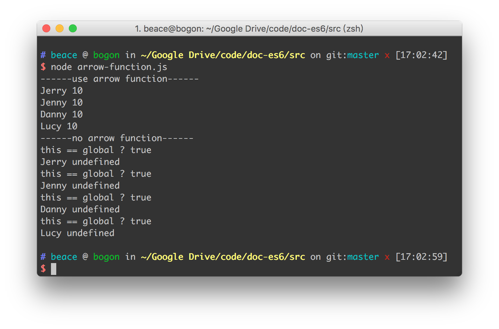
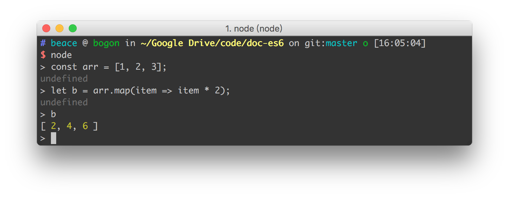
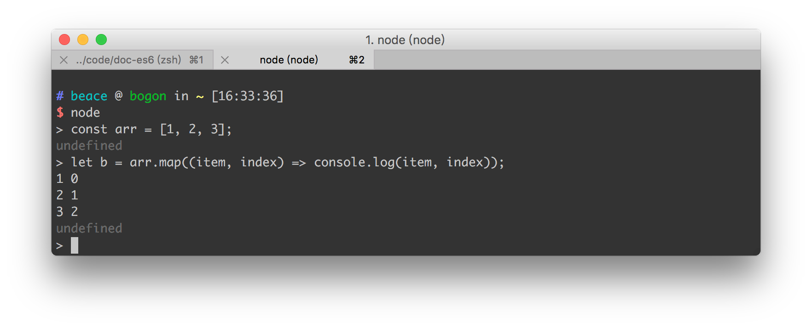

# ECMAScript 2015 Features

## arrow && function

#### 相同点

- 都表示一个函数（箭头函数可以看做 `function` 的语法糖）

#### 写法上的不同点（其他不同点参考下文）

##### arrow function

```js
var f = () => {
    console.log("This is a arrow function.")
}
f() // This is a arrow function.
```

##### function

```js
var f = function() {
    console.log("This is a functions-function. ")
}
```


### arrow && this

- 箭头函数保留了`this`的上下文环境（箭头函数不影响上下文`this`的指向）
- 如果一个箭头在另一个函数内部，则他们共享父函数的`argument`变量

使用箭头函数的写法

```js
function F(names) {
    this.names = names;
    this.age = 10;
    this.getOne = function() {
        this.names.forEach(name => console.log(name, this.age))
    }
}
const names = ['Jerry','Jenny', 'Danny', 'Lucy'];
const f = new F(names);
f.getOne();
```

传统写法

```js
function F(names) {
    this.names = names;
    this.age = 10;
    this.getOne = function() {
        this.names.forEach(function(name) {
            console.log(this == global);
            console.log(name, this.age)
        })
    }
}
const names = ['Jerry','Jenny', 'Danny', 'Lucy'];
const f = new F(names);
f.getOne();
```

##### screenshot




## Arrow

### 写法

- 单参数

省略`return`
<br/>
当含有一个参数时，可以省略参数

```js
const arr = [1, 2, 3];
let b = arr.map(item => item * 2);
```

##### screenshot



- 多参数

```js
const arr = [1, 2, 3];
arr.map((item, index) => console.log(item, index));
```

##### screenshot

